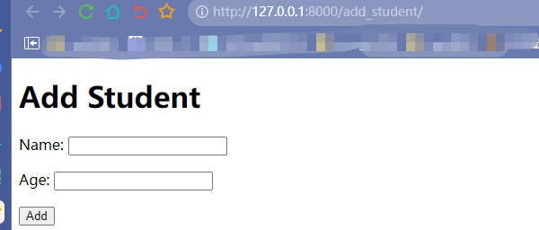
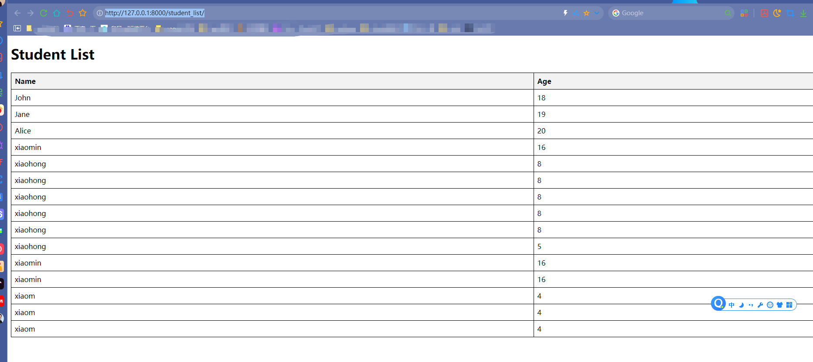

其实不需要这个demo，funboost 和django  flask  fastapi 任意web框架搭配没有任何区别，
但是有的人老是爱问 funboost 怎么和某某web框架搭配，那就写一个项目。

funboost 和django搭配不像 django_celery 还要专门特意搞个三方插件包，完全不需要，在任何web框架中使用funboost都没有需要专门学习的三方插件包。 

# 演示 funboost + django + 函数中操作 orm

之前的项目中没有演示函数里面操作 orm,导致很多人一直不懂怎么操作orm,主要是没执行 django.setup()

这是之前的funboost + django演示项目:

https://github.com/ydf0509/django_use_funboost


现在新增演示orm操作,demo是学生管理,后台函数中orm来添加学生(关键是要执行django.setup())


## 2 funboost执行普通函数和执行django 的 有orm操作函数的区别是什么?

### 2.1 下面这个add函数里面没有操作django orm,所以好说
```
def add(x,y):
    return x+ y

```

### 2.2 下面这个 create_student 函数里面操作了orm,所以有点区别
```python
def create_student(name, age, ):
    ''' 在funboost 后台进程中去操作 dajngo  orm'''
    student = Student.objects.create(name=name, age=age, )
    print(f"Created student: {student.name}")
```

```
其实只要django基础扎实的人,很容易就知道funboost或者独立的python脚本中为什么直接运行不了 create_student 这个函数,
用户自己如果在view视图 函数里面调用这个 create_student 函数,是很容易操作到orm的,

即使不使用funboost框架,用户如果自己想在独立的脚本中直接运行 create_student 这个函数,那就要做点额外的操作了,
因为 你直接在一个独立的脚本中调用这个create_student函数脱离了web上下文,django在启动web时候,会执行获取用户配置的,读取了包括数据库连接配置在内的配置,
只有读取了这些配置后,orm才知道要操作什么ip的数据库啊,用什么账号 密码来连接数据库啊,这个很明显的简单道理,你难道想不到吗?那肯定是要先读取和设置数据库相关的配置啊

```

这是 models.py 文件的代码,可以看到里面没有数据库ip 账号 密码,

你想直接用orm运行那是不可能的,得先告诉orm要操作数据库的ip和账号 密码啊,
```python
from django.db import models

# Create your models here.

from django.db import models

class Student(models.Model):
    name = models.CharField(max_length=100)
    roll_number = models.CharField(max_length=20)
    age = models.IntegerField()
    grade = models.CharField(max_length=10)

    def __str__(self):
        return self.name

    class Meta:
        app_label = 'students'
```

### 2.3 实现django先读取和设置数据库账号密码,再执行orm,关键是要 django.setup()

所以如果脱离了django web环境,想在独立的python脚本或funboost后台中运行 create_student ,那就要先执行 dajngo.setup()

dajngo.setup() 会读取配置文件,之后orm才能知道要操作什么数据库,账号密码是什么啊.

在python脚本的代码的最上面加上以下4行就行了

```python
import os

os.environ.setdefault('DJANGO_SETTINGS_MODULE', 'funboost_django_orm_demo.settings') # 这个是你的dajngo配置文件,里面包括了数据库账号密码.

import django

django.setup()
```


## 3 运行demo

本demo是在funboost中操作dajngo orm

关键文件 students/your_functions.py 中操作orm

### 3.0 生成数据库

funboost_django_orm_demo/settings.py 配置数据库连接,也可以使用sqlite

```
DATABASES = {
    'default': {
        'ENGINE': 'django.db.backends.mysql',
        # 'ENGINE':'pymysql',
        'NAME': 'testdb',
        'USER': 'root',
        'PASSWORD': '123456',
        'HOST': '127.0.0.1',
        'PORT': '3306',
    }
}
```


在项目根目录下运行以下命令，使Django生成数据库迁移文件：
python manage.py makemigrations

执行数据库迁移命令，将模型映射到MySQL数据库：
python manage.py migrate


### 3.1 启动后台消费

运行 python run_funboost.py 文件,启动消费

可以看到,代码最上面中加了4行代码,django.setup()是关键,代码如下:

```python
import os

os.environ.setdefault('DJANGO_SETTINGS_MODULE', 'funboost_django_orm_demo.settings')

import django

django.setup()

### 上面这四行是必须要做的非常非常重要,如果脱离了web上下文环境,在独立的函数或者在funboost 或 celery 后台中运行,一定先要设置好 DJANGO_SETTINGS_MODULE 环境变量,并执行 django.setup()


from students.your_functions import create_student

if __name__ == '__main__':
    create_student.consume()

```

### 3.2 启动web


python manage.py runserver


打开 http://127.0.0.1:8000/add_student ,在网页上添加学生




添加学生是在funboost后台中运行的,添加学生后,再过0.1秒 刷新 学生列表页面,就能看到添加的学生了.

http://127.0.0.1:8000/student_list/


